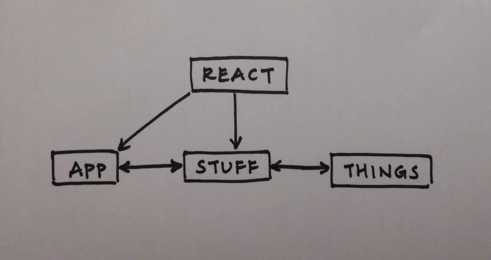
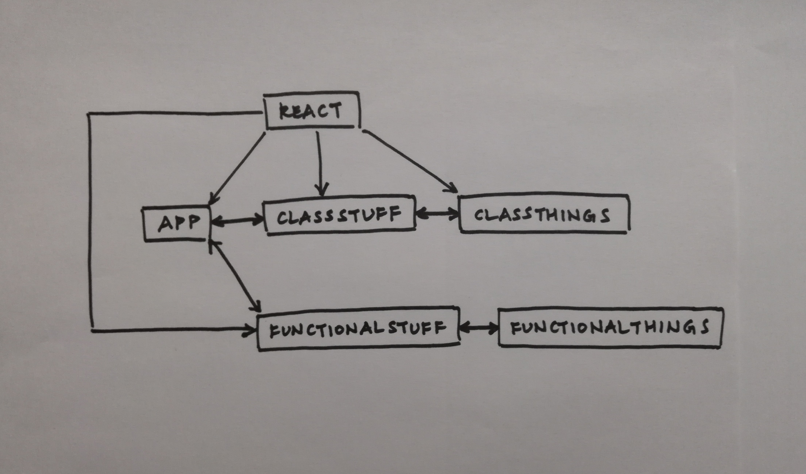

 LAB 29
=================================================

## Component Composition

### Katherine Smith

### Links and Resources
* [Assignment 1](https://codesandbox.io/s/6lj08y725r)
* [Assignment 2](https://codesandbox.io/s/24v5r87xpn)

---
### Assignment 1
#### App Component
- Passes `` tags to Stuff component
- Renders Stuff component

#### Stuff Component
- Passes `` tags to Things component using children property
- Renders Things component

#### Things Component
- Renders `` tags using children property

#### UML

---
### Assignment 2
#### App Component
- Passes `` tags to FunctionalStuff component
- Renders FunctionalStuffStuff component
- Passes `` tags to ClassStuff component
- Renders ClassStuff component

#### FunctionalStuff Component
- Passes `` tags to FunctionalThings component using children property
- Renders FunctionalThings component

#### FunctionalThings Component
- Renders `` tags using children property

#### ClassStuff Component
- Passes `` tags to ClassThings component using children property
- Renders ClassThings component

#### ClassThings Component
- Renders `` tags using children property

#### UML
